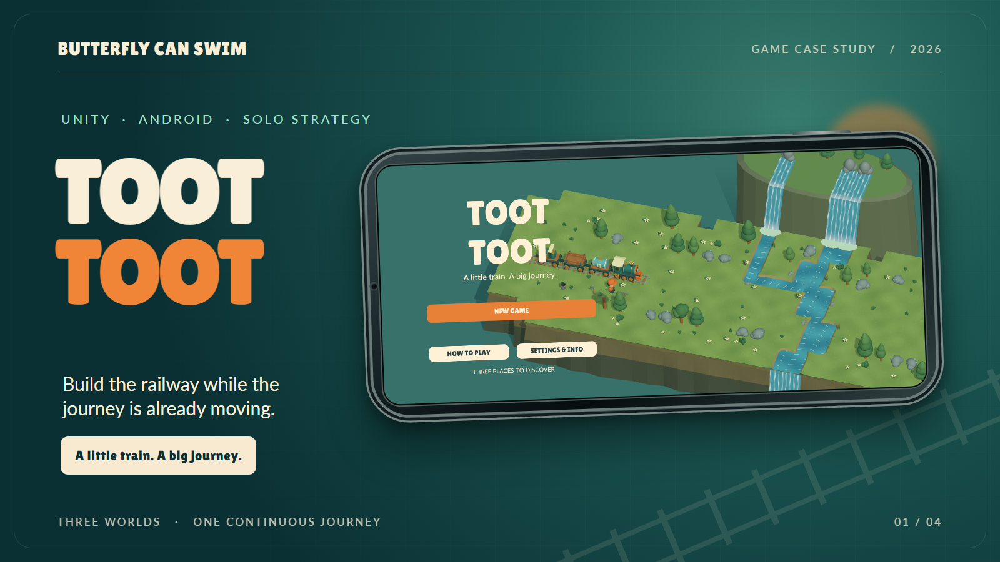
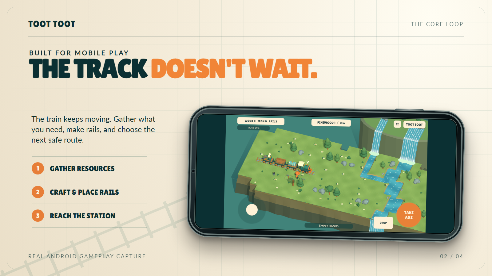
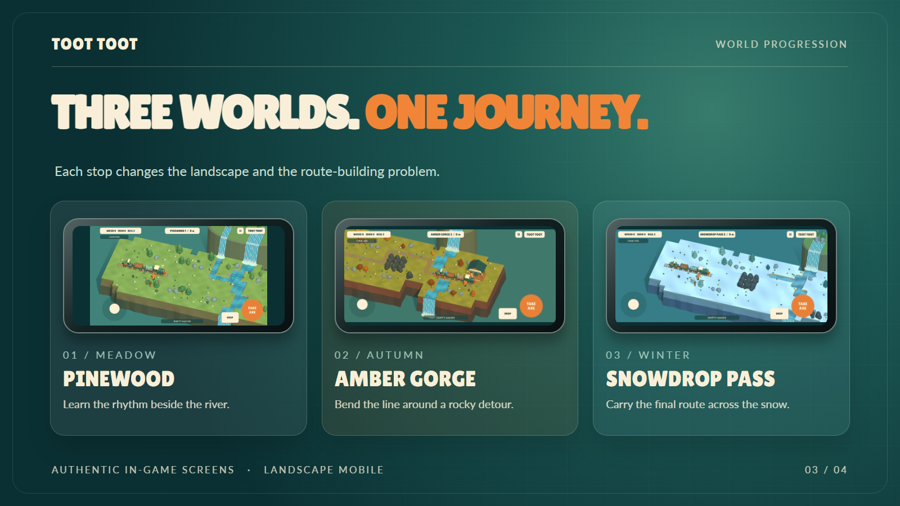
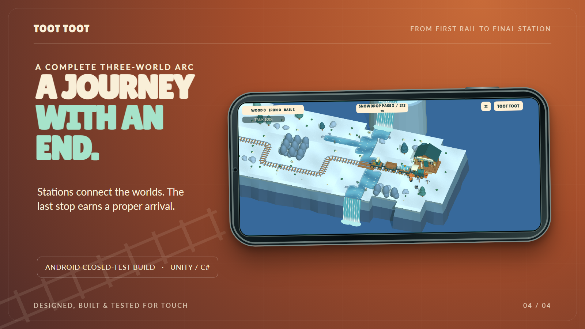
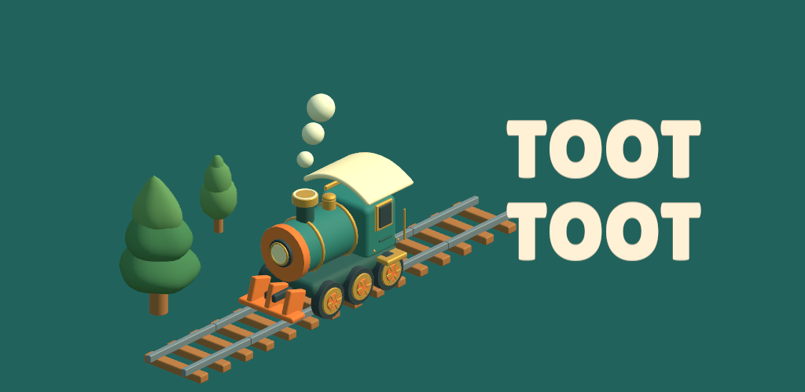

# Toot Toot

**A little train. A big journey.** Toot Toot is a landscape Android game about laying a route before a moving train reaches the end of its track. The player gathers materials, crafts rails, crosses rivers, cools the engine and guides the train through three connected worlds.

| | |
| --- | --- |
| **Platform** | Android, landscape, solo play |
| **Built with** | Unity, C#, original stylized 3D game presentation |
| **Scope shown** | Three-world 0.6.0 closed-test build, September 2026 |
| **Work** | Game design, gameplay systems, world presentation, mobile controls, release and device QA |

## The design problem

The best moments in a rail-building game happen when a small decision has an immediate consequence: the track bends toward a safe route, a river demands a bridge, or the locomotive reaches the last rail before the next piece is ready. Bringing that loop to a solo phone game required clear placement feedback, large touch controls and a world that stays readable while the train moves.

The moment-to-moment loop is deliberately short: **gather wood and iron → craft rails → place the next route → keep the train running → reach the station**. Water requires a wood foundation before ordinary track can cross it. The player can walk across a separate footbridge, while cooling the train competes for attention with construction. A nearby rail preview helps with precision without choosing every route for the player.

## Three places, one continuous journey

Pinewood introduces the rhythm of gathering and building beside a river. Amber Gorge asks for deliberate turns around rocky terrain. Snowdrop Pass changes the terrain and palette for the final approach. Stations connect the worlds, offer upgrades and give the journey a real finish instead of an endless track counter.

## How the game was built

- **Rules separate from presentation.** Player actions enter an authoritative simulation as commands. The world view, animation and audio present the resulting state. This keeps input, game rules and visuals from becoming one tightly coupled system. Online multiplayer is a possible future direction; it is **not** in the build shown here.
- **Mobile-first interaction.** The game uses large landscape touch controls, contextual actions and a rail preview that shows where a piece will go before the player builds it. Both landscape orientations are supported in the 0.6.0 Android build.
- **Distinct routes with shared systems.** The three worlds reuse the same train, building and inventory rules while changing layout, terrain, crossings and visual atmosphere.
- **Progress and outcomes.** Local saving supports Continue. Station handoffs, a final victory and cause-specific failure states give the player clear outcomes and a way back into play.

## Testing and iteration

The 0.6.0 Android bundle was accepted for the closed-testing track. Focused phone checks covered startup, later-world presentation, the station handoff and final win/loss states. Deterministic checks also covered three-world progression (27 cases), simulation rules (250 cases) and journey behavior (15 cases). These checks support the stated behavior; they do not replace an ordinary human playthrough of every route.

Closed-test players responded positively to laying rails and asked for more levels. The third world was added in response. This case study shows the resulting **three-world solo game**. Separate gameplay experiments in development are outside this release snapshot.

## A brand made from the game

The Play feature graphic uses the same locomotive, trees, rails and colors as the game. It was rendered from the game models rather than assembled from unrelated stock art.

## Image and source notes

Every screen inside the landscape phone frames is a real Toot Toot game capture. The frames, typography and backgrounds are case-study presentation artwork. Some later-world and ending screens were reached with staged saves for capture and focused verification; they are supported game states, not evidence of an uninterrupted human run.

The Unity game project, upload signing material and Android bundles are not distributed here. This repository contains only the case study and its five displayed images. © 2026 Butterfly Can Swim. Game imagery and case-study text are reserved.

For product or development enquiries, reach [Abdalla Ashraf on GitHub](https://github.com/abdalla-ashraf-M7).
